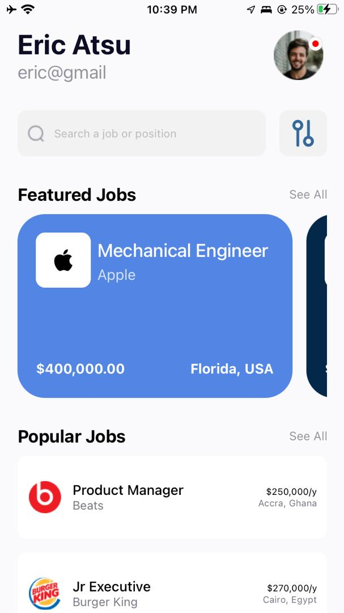

# React Native Application
## Student ID: 11014111
### Project Overview
This is a React Native application created using Expo CLI. The app is called 'Jobizz'. It was created for my third assignment in Mobile Application Development. 

### What does this app do?
The app is a job search app. It was created using the UI mockup found at [this link](https://www.figma.com/design/CGpaaLigc1W8ij1mLJMvev/Assignment-4?node-id=0-1&t=BzAeaEP1AYtzOeHl-0s), or [`here in this repository`](./DCIT202-Assignment-4-UI-mockup.fig).

### Project Structure
- [`app-screenshots`](./app-screenshots/): Contains screenshots of the application
- [`assets`](./assets/): Contains images and other assets used in the application, such as logos and icons
- [`components`](./components/): Contains all reusable components used across different parts of the application. Each component is organized in a relevant subfolder
- [`pages`](./pages/): Contains the main pages (Home and Login)
- [`styles`](./styles/): Contains styling files for the components and pages
- [`App.js`](./App.js): Main entry point of the app. It sets up the root component and navigation
- [`app.json`](./app.json): Configuration file for the Expo project, defining project settings and metadata
- [`babel.config.js`](./babel.config.js): Babel configuration file, used to specify how JavaScript code is compiled
- [`DCIT202-Assignment-4-UI-mockup.fig`](./DCIT202-Assignment-4-UI-mockup.fig): UI mockup used as a reference for creating this app
- [`package-lock.json`](./package-lock.json): Automatically generated file that describes the exact tree of dependencies that were installed for the project
- [`package.json`](./package.json): Contains metadata about the project, including dependencies, scripts, and project info
- [`README.md`](./README.md): This README file, providing an overview and documentation for the project

### Components Structure And Usage
- Login
    - AppName: Made up of the app name, 'Jobizz'
    - Headline: Welcome message
    - LoginForm: Form where the user enters their name and email. Name and email are passed as props to the home page
    - OtherLoginOptions: Other ways of logging in 
- Home
    - UserProfile: Name and email passed from the login form, as well as a profile icon
    - Search: Search bar and filter option
    - FeaturedJobs
        - FeaturedJobsList: List of featured jobs (hardcoded)
            - Each job is rendered using the FeaturedJobsCard component
    - PopularJobs
        - PopularJobsList: List of popular jobs (hardcoded)
            - Each popular job is rendered using the PopularJobsCard component
- App 
    - Routes: Contains navigation process from login to home page

### App features
- User login with name and email
- Display user profile with name and email
- Search for jobs
- View featured jobs
- View popular jobs

### Technology Stack Used

- React Native
- Expo CLI
- Other dependencies found in the [`package.json`](./package.json) file

### Clone This Repository
- Open your terminal and navigate to the folder you want this repository to be cloned.
- Paste the following command
```
git clone https://github.com/favourrr-a/rn-assignment4-11014111.git
```
- Navigate to the project directory
```
cd rn-assignment4-11014111
```
### Screenshots Of The Application





